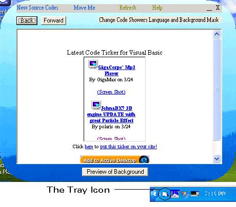



## New Source Codes \.\.:: Final Version ::\.\.

### Description

This program is probably the best program I have ever done. Although I had to borrow some codes to make it perfect. This is the last vesion. Look at the screenshot and you can see that I have rounded corners on the form and a SYSTRAY when the form is minimized. You can put background pictures in and you can preview them also. There is a HELP section in there just about the program. Thanks in advance and PLEASE LEAVE COMMENTS and VOTE APPROPRIATLY.
 
### More Info
 

             |
---                |---
**Submitted On**   |2002-03-24 19:16:56
**By**             |[Sehab](https://github.com/Planet-Source-Code/PSCIndex/blob/master/ByAuthor/sehab.md)
**Level**          |Intermediate
**User Rating**    |3.1 (22 globes from 7 users)
**Compatibility**  |VB 6\.0
**Category**       |[Miscellaneous](https://github.com/Planet-Source-Code/PSCIndex/blob/master/ByCategory/miscellaneous__1-1.md)
**World**          |[Visual Basic](https://github.com/Planet-Source-Code/PSCIndex/blob/master/ByWorld/visual-basic.md)
**Archive File**   |[New\_Source6512032420\.zip](https://github.com/Planet-Source-Code/sehab-new-source-codes-final-version__1-33035/archive/master.zip)

